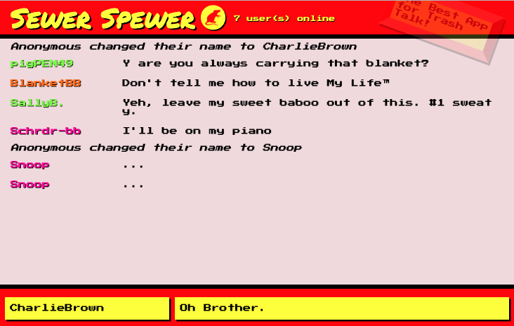

## Sewer Spewer

Sewer Spewer is primarily a client-side single page app that bills itself as the best app for trash talk. Aside from sending rude messages to one another, chatters can enter an image URL to send pngs, gifs and jpgs. Users are identified by whatever name they choose and one of four (_!!!_) random colours. Messages are broadcasted to all users via the WebSockets server! Totally Radical™.

### Tech Stack

* ReactJS
* JSX
* ES6
* Webpack with Babel
* Webpack dev server
* WebSockets
* Node.js

### Instructions:
 1. Fork this repo and clone it to your local machine
 2. Install dependencies with `npm install`
 3. Next, let's get our WebPack server running by entering `npm start` in the command line.
 4. In a separate terminal window, navigate to `/chatty_server` and enter `npm start` to run the WebSockets server 
 5. Visit http://localhost:3000 in your browser and start a conversation with ... yourself?

---
Snaps from the Sewer:

instense chatting action

gifs! everybody love 'em

---
Thanks:
Lighthouse Labs, the mentors, fellow dev students <3

*Bye bye for now! *
